## 养老服务项目设计
养老服务领域尚未被解决的痛点举例：
* 我们如何能够降低衰弱期老年人跌倒带来的风险？
* 我们如何能够给衰老期老年人提供可信任的健康咨询？
* 我们如何能够提升衰弱期老年人的睡眠质量？
* 我们如何能够缓解老年人因失能带来的心理痛苦？

1. 确定主要目标用户：
* 60-75岁手机达人
* 60-75岁手机小白
2. 解决问题：老年人数字鸿沟
* 微观：老年人学习手机软件应用
* 宏观：如何真正通过数字化产品让老年人生活更便捷、幸福感更高
3. 切入点：社区生活平台
4. 背后逻辑：通过社区生活平台创造学习情境，采用同伴教育的方式（手机达人教手机小白），教授数字产品使用。该平台对接线下商户，可切实满足老年人社区生活需求

## 产品架构图

## 成果展示
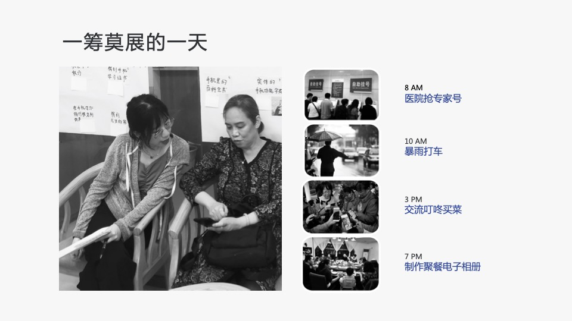
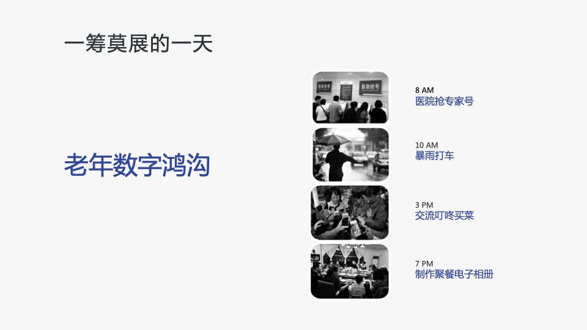
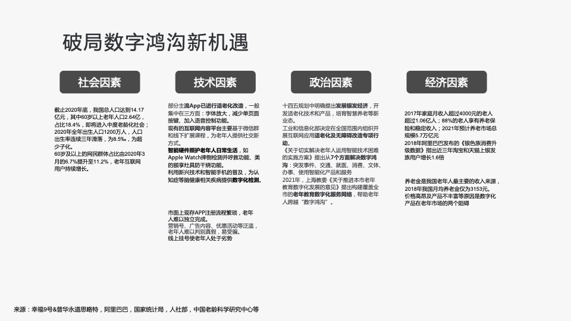
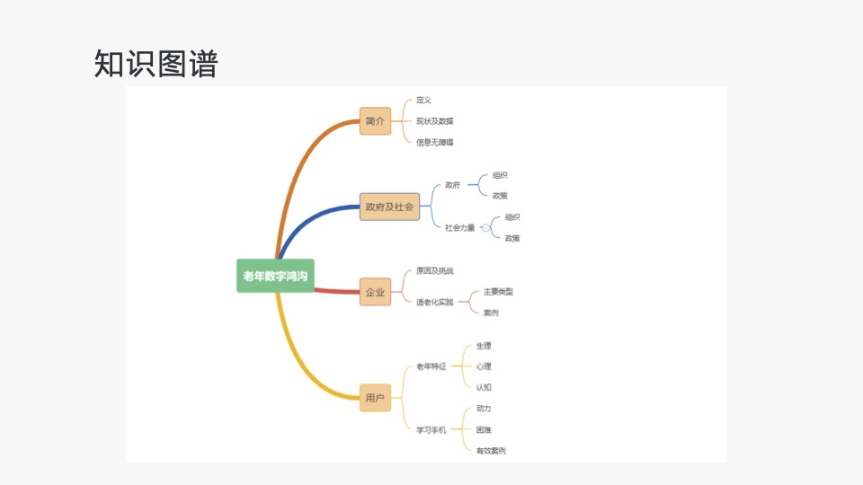
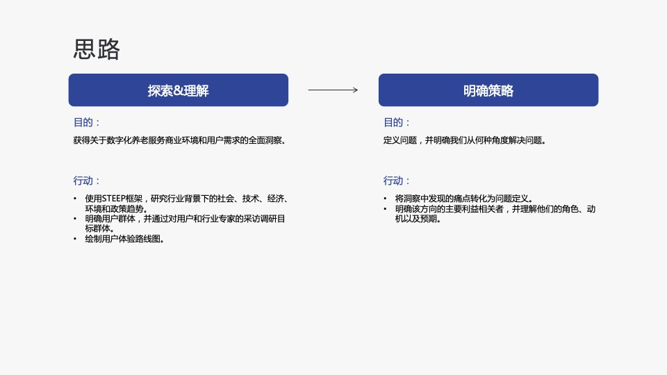
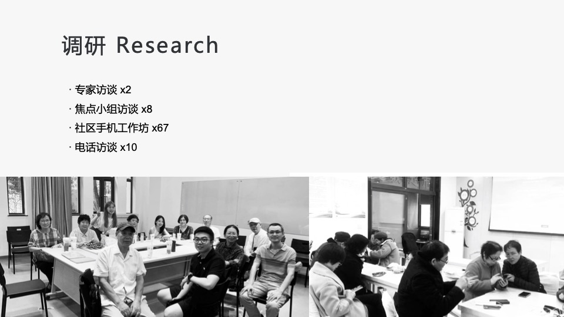
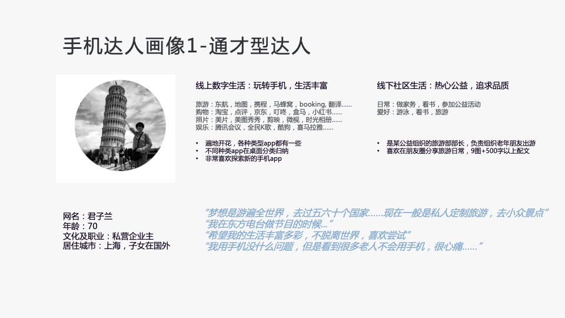
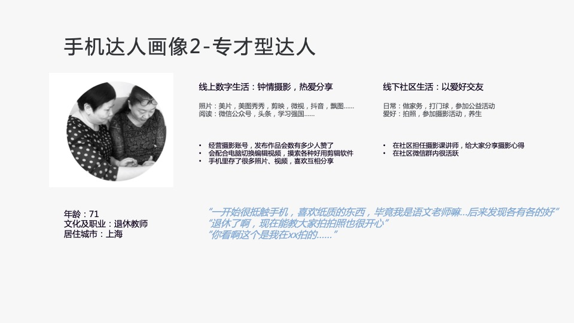
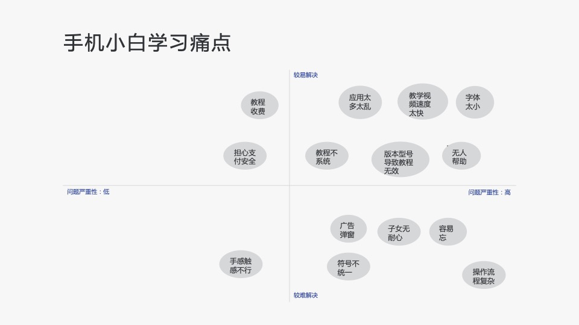
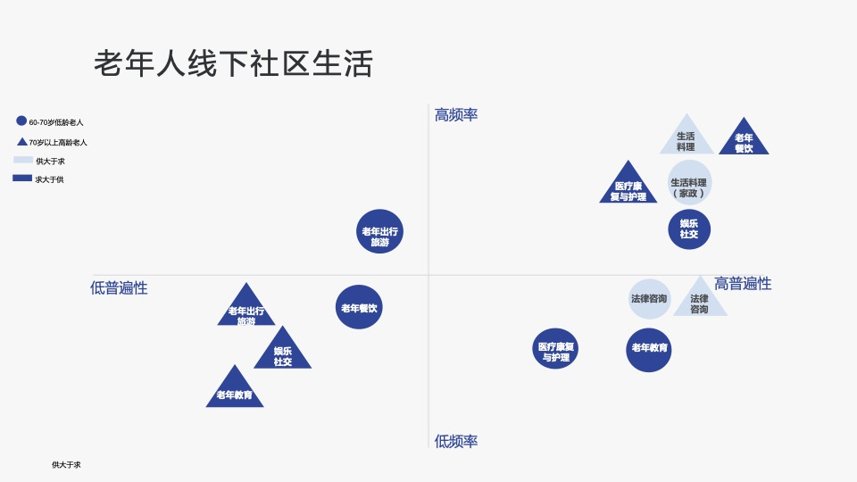
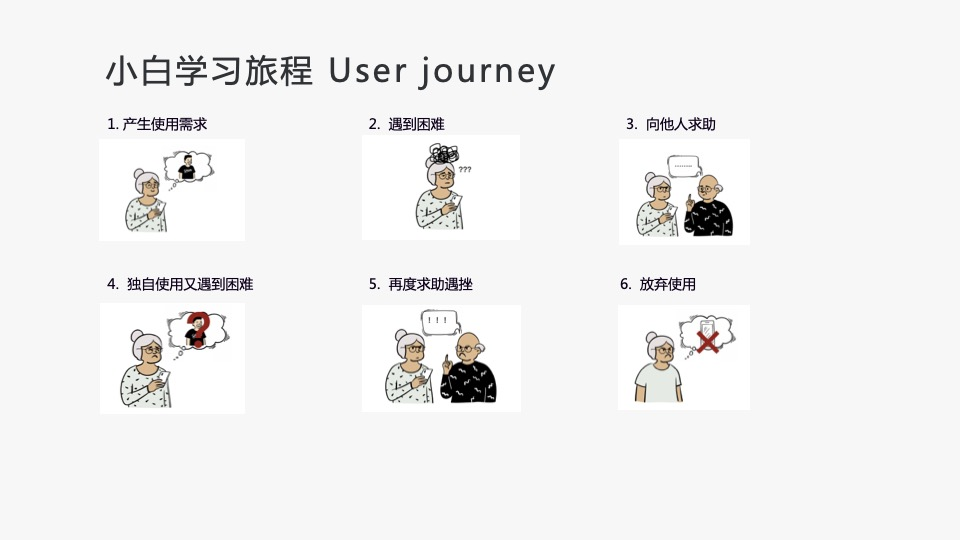
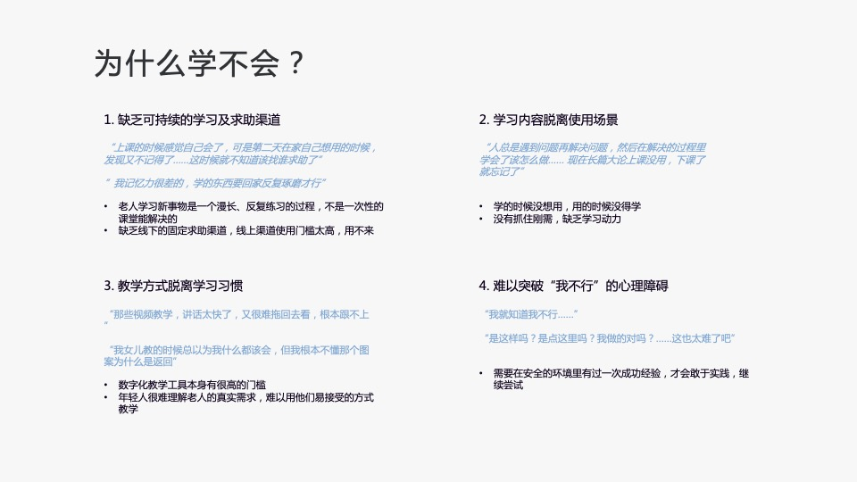
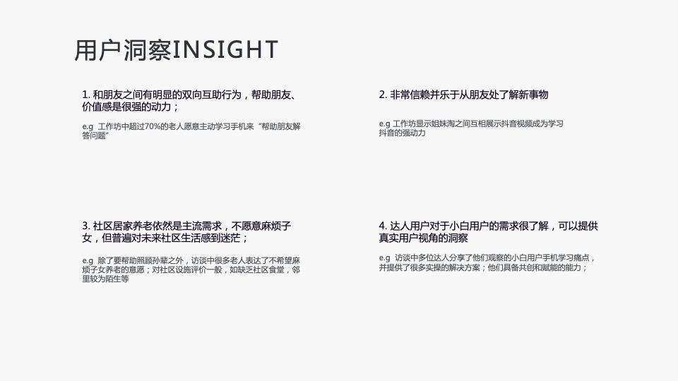
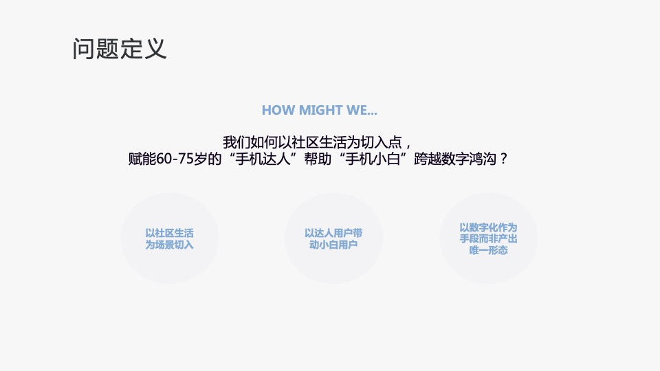
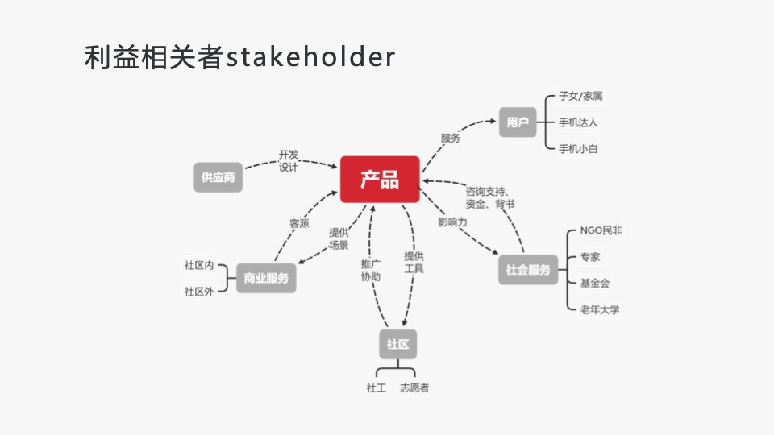

**未完待续**